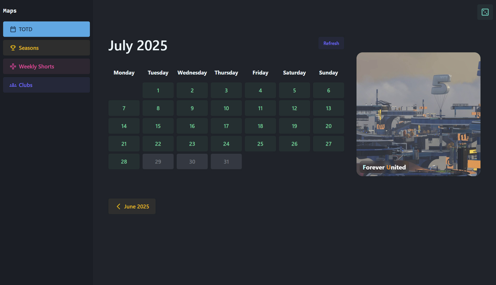
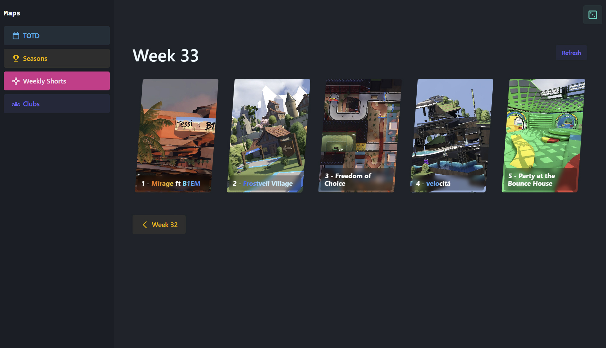

# **Mania Explorer**

An elegant and powerful desktop application for Trackmania that allows you to easily discover, browse, and play a vast library of maps directly on your PC.

Built with modern web technologies and packaged as a lightweight desktop app, it provides a seamless bridge between the huge online map databases and your game client.

## **✨ Features**

* **Track of the Day (TOTD):** Browse and play any TOTD map from previous months and years.  
* **Official Campaigns:** Revisit and play maps from any previous official campaign season.  
* **Weekly Shorts:** Catch up on the current and previous "Weekly Shorts" campaigns.  
* **Club Campaigns:** Discover and play campaigns created by the community.
* **Random Map:** Feeling adventurous? Hit the "Random Map" button to get a surprise track from the Trackmania Exchange database.

## **📸 Screenshots**

Here’s a glimpse of what the app looks like.

| Feature | Screenshot |
| :---- | :---- |
| **Track of the Day** |  |
| **Campaign** |  |
| **Weekly Shorts** |  |
| **Club Campaigns** |  |

## **🛠️ Technologies & Integrations**

This application is built with a modern and efficient technology stack:

* [**Tauri**](https://tauri.app/)**:** A framework for building tiny, blazing-fast binaries for all major desktop platforms.  
* [**Tailwind CSS**](https://tailwindcss.com/)**:** A utility-first CSS framework for rapid UI development.  
* [**DaisyUI**](https://daisyui.com/)**:** A component library for Tailwind CSS to build beautiful UIs even faster.

### **API Integrations**

The map data is sourced from these incredible community platforms:

* [**trackmania.io**](https://trackmania.io/)**:** Provides comprehensive data for official campaigns, TOTDs, and more.  
* [**Trackmania Exchange (TMX)**](https://trackmania.exchange/)**:** The largest community-driven database for Trackmania maps, powering the "Random Map" feature.

## **🚀 Setup Guide**

Getting started is simple. Follow these steps to install the application:

1. **Download the Installer:** Go to the [**GitHub Releases**](https://github.com/itsmeeudrino/mania-explorer/releases) page.  
2. **Get the Latest Version:** Download the .msi installer file from the latest release.  
3. **Run the Installer:** Double-click the downloaded file and follow the on-screen instructions to install the application.

### **❗ Important First-Time Setup Note**

The very first time you click "Play" on a map, your computer won't know how to open the map file. Windows will show a prompt asking you how to open a .Map.Gbx file.

**You must select Trackmania.exe from your game's installation folder.**

* Click **"More apps"**.  
* Scroll down and click **"Look for another app on this PC"**.  
* Navigate to where you installed Trackmania (e.g., C:\\Program Files\\Ubisoft\\Ubisoft Game Launcher\\games\\Trackmania).  
* Select Trackmania.exe.  
* Make sure the "Always use this app to open .Map.Gbx files" checkbox is ticked.

You only need to do this once\! After that, all maps will open in the game automatically.

## **🤝 Contributing**

This is an open-source project, and contributions are welcome\! Whether it's reporting a bug, suggesting a new feature, or submitting a pull request, your help is appreciated.

1. Fork the repository.  
2. Create your feature branch (git checkout \-b feature/AmazingFeature).  
3. Commit your changes (git commit \-m 'Add some AmazingFeature').  
4. Push to the branch (git push origin feature/AmazingFeature).  
5. Open a Pull Request.

## **📄 License**

This project is distributed under the MIT License. See the LICENSE file for more information.